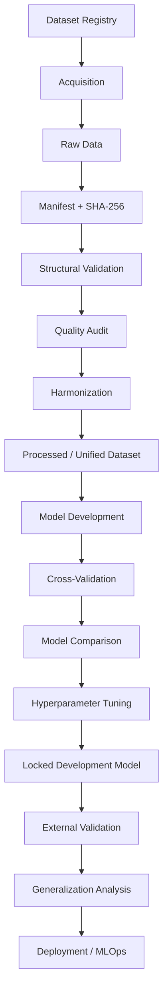

# Heart Disease ML Research Pipeline

> **A provenance-first, reproducible machine-learning research pipeline for evaluating heart-disease prediction across heterogeneous real-world datasets and populations.**

[](https://www.python.org/)
[](https://scikit-learn.org/)
[](#testing)
[](#data-philosophy)
[](#research-scope)

---

## Why this project exists

Most beginner heart-disease ML projects stop at:

```text
CSV
  ↓
Train/Test Split
  ↓
Logistic Regression
  ↓
Accuracy
```

This project is intentionally going further.

The central research question is:

> **Can a heart-disease prediction model developed on established benchmark data remain reliable when the underlying population, institution, geography, clinical setting, and data distribution change?**

The project therefore treats **data infrastructure, provenance, harmonization, evaluation, and generalization** as first-class parts of the ML system.

The long-term target is a multi-country, real-world cardiovascular ML research pipeline beginning with **UCI as the development benchmark** and expanding toward **Nigeria, Africa, and other global populations**.

---

# Table of Contents

- [Current Snapshot](#current-snapshot)
- [Core Principles](#core-principles)
- [Research Question](#research-question)
- [System Architecture](#system-architecture)
- [Project Lifecycle](#project-lifecycle)
- [Current ML Baseline](#current-ml-baseline)
- [Dataset Strategy](#dataset-strategy)
- [UCI Development Benchmark](#uci-development-benchmark)
- [Nigeria Track](#nigeria-track)
- [Dataset Registry](#dataset-registry)
- [Dataset Lifecycle States](#dataset-lifecycle-states)
- [Acquisition and Manifests](#acquisition-and-manifests)
- [Ingestion](#ingestion)
- [Quality Auditing](#quality-auditing)
- [Harmonization](#harmonization)
- [Duplicate Detection](#duplicate-detection)
- [Model Comparison](#model-comparison)
- [Evaluation Strategy](#evaluation-strategy)
- [External Validation](#external-validation)
- [Repository Structure](#repository-structure)
- [Getting Started](#getting-started)
- [Useful Commands](#useful-commands)
- [Testing](#testing)
- [Reproducibility](#reproducibility)
- [Data Governance](#data-governance)
- [Roadmap](#roadmap)
- [Research Philosophy](#research-philosophy)
- [Limitations](#limitations)
- [Disclaimer](#disclaimer)

---

# Current Snapshot

| Area | Status |
|---|---|
| Modular ML pipeline | ✅ Complete |
| Training / prediction | ✅ Complete |
| Model persistence | ✅ Complete |
| Stratified cross-validation | ✅ Complete |
| Multi-metric evaluation | ✅ Complete |
| Model comparison | ✅ Complete |
| Dataset registry | ✅ Complete |
| Dataset provenance | ✅ Complete |
| UCI dataset ingestion | ✅ Complete |
| Dataset quality auditing | ✅ Complete |
| Dataset harmonization | ✅ Complete |
| Duplicate analysis | ✅ Complete |
| Processing-state tracking | ✅ Complete |
| Raw-data manifest / SHA-256 support | ✅ Implemented |
| Nigerian dataset candidate | 🟡 Access pending |
| Hyperparameter tuning | 🔵 Next |
| Explainability | 🔵 Planned |
| Independent Nigerian validation | 🔵 Waiting for data access |
| FastAPI inference | 🔵 Planned |
| Docker / deployment | 🔵 Planned |

### Current principle

**Real-world data only. No synthetic data is part of the dataset expansion strategy.**

Synthetic data is deliberately excluded from the project's evidence-building pipeline. The objective is to obtain, document, validate, and harmonize real datasets instead of manufacturing additional observations.

---

# Core Principles

This repository is built around a few non-negotiable ideas:

### 1. Provenance before performance

We should know **where every dataset came from** before using it.

### 2. Raw data is not to be casually rewritten

Source files should be preserved as acquired. Transformations belong downstream.

### 3. Harmonization must be explicit

Different datasets can share similar-looking columns while representing different measurements, populations, units, or outcome definitions.

### 4. A larger row count is not automatically better

Data quality, representativeness, independence, provenance, and external validity matter more than row count alone.

### 5. External validation matters

A high benchmark score is not evidence that a model is globally reliable.

### 6. Pending data is not training data

A dataset may exist in the registry without being available to the ML pipeline.

### 7. No synthetic data for evidence expansion

New clinical evidence should come from real-world observations, not generated rows.

---

# Research Question

The project's long-term question is:

> **Can machine-learning models trained on real-world cardiovascular datasets generalize reliably across different populations and data distributions?**

That leads to a progression such as:

```text
UCI Development Benchmark
          ↓
Internal Cross-Validation
          ↓
Model Comparison
          ↓
Hyperparameter Tuning
          ↓
Locked Development Candidate
          ↓
Independent Dataset
          ↓
External Validation
          ↓
Cross-Population Analysis
          ↓
Generalization / Dataset-Shift Analysis
```

The model is therefore only one component of the project.

---

# System Architecture

The project is evolving toward a layered research and ML architecture:



### Why the layers are separated

Without this separation, a dataset can silently move from:

```text
download
→ cleaning
→ target conversion
→ merge
→ training
```

without anyone being able to reconstruct what happened.

Here, each transformation is intended to be inspectable and testable.

---

# Project Lifecycle

Every dataset should eventually progress through a controlled lifecycle:

```text
CANDIDATE
   ↓
ACCESS_PENDING
   ↓
ACCESS_GRANTED
   ↓
ACQUIRED
   ↓
VALIDATED
   ↓
AUDITED
   ↓
HARMONIZED
   ↓
READY
```

The system uses two complementary concepts:

## Access status

Answers:

> **Can we legally/technically access the dataset?**

Examples:

```text
CANDIDATE
ACCESS_PENDING
ACCESS_GRANTED
ACQUIRED
RESTRICTED
REJECTED
```

## Processing status

Answers:

> **How far has the dataset progressed through our data pipeline?**

Examples:

```text
NOT_STARTED
VALIDATED
AUDITED
HARMONIZED
READY
```

This separation is critical.

For example, the Nigerian Kano dataset can be:

```text
access_status     = ACCESS_PENDING
processing_status = NOT_STARTED
```

It is therefore visible to the registry but must not enter ingestion, harmonization, training, or evaluation.

---

# Current ML Baseline

The current development dataset is the existing heart-disease CSV used for model development.

The three baseline models are evaluated under the **same 5-fold StratifiedKFold setup** and the **same metrics**.

### UCI development comparison

| Model | Accuracy | Precision | Recall | F1 | ROC-AUC |
|---|---:|---:|---:|---:|---:|
| **Logistic Regression** | **0.837 ± 0.049** | **0.831 ± 0.028** | **0.792 ± 0.102** | **0.809 ± 0.067** | **0.897 ± 0.044** |
| Random Forest | 0.804 ± 0.093 | 0.806 ± 0.130 | 0.750 ± 0.075 | 0.776 ± 0.099 | 0.877 ± 0.049 |
| Gradient Boosting | 0.793 ± 0.059 | 0.789 ± 0.086 | 0.733 ± 0.073 | 0.759 ± 0.070 | 0.856 ± 0.048 |

### Current interpretation

On this development benchmark and evaluation setup:

**Logistic Regression is currently the strongest baseline candidate.**

That does **not** mean it is the final model.

It means that, before tuning and independent external validation, it currently provides the strongest baseline among the three evaluated models.

The model comparison is intentionally based on:

```text
same features
same preprocessing
same folds
same random state
same metrics
```

so that model choice is not driven by inconsistent experimental conditions.

---

# Dataset Strategy

The project follows a staged data strategy.

## Stage A — Development benchmark

Use established benchmark datasets for:

- engineering
- regression testing
- algorithm comparison
- rapid iteration
- reproducible experiments

### Current benchmark

**UCI Heart Disease**

---

## Stage B — Nigerian validation

The next major target is legitimate access to Nigerian clinical data.

Nigeria is the project's first geographic expansion target because the long-term objective is not merely to perform well on a historical Western benchmark.

We want to measure whether a model developed elsewhere remains reliable on Nigerian data.

---

## Stage C — African expansion

Potential future regions include:

```text
Nigeria
Ghana
South Africa
Other documented African cohorts
```

---

## Stage D — Global expansion

The architecture is intended to support datasets from additional countries and regions.

The goal is not simply:

```text
more rows
```

but:

```text
more real-world diversity
```

---

# UCI Development Benchmark

UCI is our **development benchmark**, not the final destination.

The UCI Heart Disease collection contains four clinical source domains:

| Source | Records |
|---|---:|
| Cleveland | 303 |
| Hungarian | 294 |
| Switzerland | 123 |
| VA Long Beach | 200 |
| **Total reported collection size** | **920** |

The project preserves the four sites as separate provenance domains.

Typical files include:

```text
processed.cleveland.data
processed.hungarian.data
processed.switzerland.data
processed.va.data
```

as well as the original/raw source files.

### Important research boundary

The four UCI sites are treated as **four source domains inside one UCI collection**, not automatically as four independent external validation datasets.

This distinction matters because:

```text
same collection
≠
independent external evidence
```

---

# Nigeria Track

The first Nigerian clinical candidate currently registered in the project is:

```text
dataset_id:
    ng_kano_cad_506

country:
    Nigeria

region:
    North-West Nigeria

access_status:
    ACCESS_PENDING

processing_status:
    NOT_STARTED
```

The candidate corresponds to the published Kano coronary artery disease study and is being pursued through a formal research data-access request.

### Current status

```text
Registry entry        ✅
Research provenance   ✅
Access request        ✅ Sent
Raw dataset           ❌ Not acquired yet
Validation            ❌ Not started
Harmonization         ❌ Not started
Model use             ❌ Not permitted yet
```

This distinction is intentional.

**We do not treat a published description of a dataset as possession of its underlying patient-level records.**

When the dataset becomes legitimately available, the workflow will be:

```text
Author / Institution
        ↓
Access Granted
        ↓
Acquire Raw File
        ↓
Generate Manifest
        ↓
Validate
        ↓
Audit
        ↓
Harmonize
        ↓
External Validation
```

---

# Dataset Registry

The registry is the metadata source of truth for datasets known to the project.

Relevant module:

```text
src/dataset_registry.py
```

A registered dataset can contain metadata such as:

```text
dataset_id
collection_id
name
description

publisher
source_url
source_file

country
region
continent
geographic_domain
site

population
collection_year
publication_year
clinical_setting

target_definition
feature_schema
feature_types
units

access_status
processing_status

license
usage_restrictions
```

### Example conceptual record

```json
{
  "dataset_id": "ng_kano_cad_506",
  "collection_id": "kano_cad_study_001",
  "country": "Nigeria",
  "region": "North-West Nigeria",
  "access_status": "ACCESS_PENDING",
  "processing_status": "NOT_STARTED"
}
```

The registry can therefore represent datasets **before** the underlying file is available.

---

# Acquisition and Manifests

Acquisition is deliberately separated from ML code.

Relevant modules:

```text
src/dataset_acquisition.py
src/dataset_manifest.py
```

The intended flow is:

```text
Registry
   ↓
Acquisition
   ↓
data/raw/<dataset_id>/
   ↓
manifest.json
```

## Manifest contents

A manifest is designed to capture information such as:

```text
dataset_id
collection_id
version
source
source_url
acquired_at
file_path
file_format
sha256
row_count
column_count
```

### SHA-256 integrity

The raw file receives a cryptographic checksum.

That allows the project to later verify:

> Is this the exact same file that was originally acquired?

Example:

```text
raw file
   ↓
SHA-256
   ↓
manifest.json
```

The current acquisition layer also supports manifest validation, including integrity and structural checks.

---

# Ingestion

Relevant module:

```text
src/dataset_ingestion.py
```

Ingestion is responsible for reading datasets while preserving their source representation and provenance.

Current provenance fields include:

```text
source_collection
source_dataset
source_file
source_row_id
```

The ingestion layer should not silently perform clinical harmonization.

Its job is to answer:

> **What did the source actually contain?**

Harmonization happens later.

---

# Quality Auditing

Relevant modules:

```text
src/dataset_quality.py
src/dataset_analysis.py
```

The project performs dataset-level inspection before using data for modeling.

Current analysis includes:

- dataset composition
- target distribution
- missingness
- source-specific missingness
- schema inspection
- duplicate analysis
- cross-source duplicate candidates
- numeric/categorical summaries
- source-shift summaries
- machine-readable JSON reports
- human-readable Markdown reports

Example conceptual workflow:

```text
Raw dataset
    ↓
Audit
    ↓
Questions:
    • How many rows?
    • Which columns?
    • What is missing?
    • What is the target distribution?
    • Which sources dominate?
    • Are duplicates present?
    • Does this source look different?
```

---

# Harmonization

Relevant module:

```text
src/dataset_harmonization.py
```

Harmonization maps compatible datasets into a canonical schema.

The canonical representation is designed to make multi-source analysis possible without pretending that different datasets are statistically identical.

Typical steps include:

```text
Feature mapping
      ↓
Schema normalization
      ↓
Missing-value normalization
      ↓
Data-type normalization
      ↓
Target harmonization
      ↓
Provenance preservation
      ↓
Duplicate analysis
```

### Example target harmonization

The UCI processed datasets can encode heart-disease severity using values such as:

```text
0
1
2
3
4
```

For binary modeling, the harmonization layer can explicitly map:

```text
0     → 0
1–4   → 1
```

The transformation is explicit rather than hidden inside ingestion.

---

# Duplicate Detection

Duplicate analysis is important because different datasets may contain overlapping or repeated observations.

The system distinguishes:

## Exact duplicates

Records matching the configured complete comparison key.

## Cross-source duplicate candidates

Records with matching canonical clinical features but different source provenance.

The second category is particularly important because:

```text
same patient / same observation
```

should not automatically become:

```text
two independent training observations
```

Duplicate detection therefore occurs before final dataset aggregation.

---

# Model Comparison

Relevant module:

```text
src/model_comparison.py
```

Current baseline models:

```text
Logistic Regression
Random Forest
Gradient Boosting
```

Each model is evaluated using the same:

```text
X / y
StratifiedKFold
random_state
preprocessing logic
metrics
```

The preprocessing template is cloned for each model so one model does not reuse a fitted preprocessing state from another model.

### Current benchmark result

```text
Logistic Regression
    Accuracy   0.837 ± 0.049
    Precision  0.831 ± 0.028
    Recall     0.792 ± 0.102
    F1         0.809 ± 0.067
    ROC-AUC    0.897 ± 0.044
```

This makes Logistic Regression our current development baseline.

---

# Evaluation Strategy

The project does not rely on accuracy alone.

Current metrics:

```text
Accuracy
Precision
Recall
F1
ROC-AUC
```

Additional evaluation outputs include:

```text
Confusion Matrix
Classification Report
Fold-level class distributions
Mean CV score
Standard deviation
Minimum fold score
Maximum fold score
```

The goal is to understand both:

```text
average performance
```

and:

```text
performance stability
```

A model with slightly better mean performance but extreme fold-to-fold instability may deserve more scrutiny than a model with slightly lower mean performance and much more stable behavior.

---

# External Validation

Eventually, the evaluation architecture will separate:

### Development evaluation

```text
UCI
 ↓
Cross-validation
 ↓
Model comparison
 ↓
Hyperparameter tuning
```

from:

### External validation

```text
Nigerian dataset
 ↓
Locked model
 ↓
No development tuning
 ↓
Independent evaluation
```

The Nigerian dataset should not become another tuning playground.

Otherwise:

```text
"external validation"
```

can quietly become:

```text
"another training dataset"
```

and the evidence becomes much less convincing.

---

# Generalization and Dataset Shift

The project is ultimately interested in distribution shift.

Potential questions include:

```text
Does age distribution change?

Does blood-pressure distribution change?

Does cholesterol distribution change?

Does target prevalence change?

Does missingness change?

Does model performance change?

Does calibration change?

Which features move the most?

Which populations experience the largest performance degradation?
```

This turns the project from a normal classification exercise into a **cross-dataset generalization study**.

---

# Repository Structure

The repository is progressively organized around source data, metadata, processing, ML, and tests.

```text
Heart Disease ML Research Pipeline/
│
├── data/
│   ├── raw/
│   │   ├── uci_hd_cleveland/
│   │   │   └── manifest.json
│   │   └── ...
│   │
│   ├── interim/
│   │
│   ├── processed/
│   │   ├── harmonized/
│   │   └── validated/
│   │
│   ├── metadata/
│   │   └── manifests/
│   │
│   ├── reports/
│   │
│   └── heart+disease/
│       ├── cleveland.data
│       ├── hungarian.data
│       ├── switzerland.data
│       ├── long-beach-va.data
│       ├── processed.cleveland.data
│       ├── processed.hungarian.data
│       ├── processed.switzerland.data
│       └── processed.va.data
│
├── models/
│   └── ...
│
├── notebooks/
│   └── playground.ipynb
│
├── src/
│   ├── train.py
│   ├── predict.py
│   ├── preprocess.py
│   ├── evaluate.py
│   ├── model_comparison.py
│   │
│   ├── dataset_metadata.py
│   ├── dataset_registry.py
│   ├── dataset_acquisition.py
│   ├── dataset_manifest.py
│   ├── dataset_ingestion.py
│   ├── dataset_validation.py
│   ├── dataset_quality.py
│   ├── dataset_harmonization.py
│   ├── dataset_analysis.py
│   └── data_registry_helpers.py
│
├── tests/
│   ├── test_pipeline.py
│   ├── test_model_comparison.py
│   ├── test_dataset_registry.py
│   ├── test_dataset_ingestion.py
│   ├── test_dataset_quality.py
│   ├── test_dataset_harmonization.py
│   └── test_dataset_analysis.py
│
├── requirements.txt
├── README.md
└── .gitignore
```

The exact tree will continue to evolve as the acquisition and MLOps layers mature.

---

# Getting Started

## 1. Clone the repository

```bash
git clone git@github.com:AI-MLGuru/heart-disease-ml-pipeline.git
cd heart-disease-ml-pipeline
```

## 2. Create the virtual environment

WSL example:

```bash
python3 -m venv .venv_wsl
source .venv_wsl/bin/activate
```

## 3. Install dependencies

```bash
python -m pip install -r requirements.txt
```

## 4. Run tests

```bash
pytest -v -rA
```

---

# Useful Commands

## Run training

```bash
python src/train.py
```

## Run model comparison

```bash
python - <<'PY'
from src.preprocess import load_data, split_features_target
from src.model_comparison import compare_models, print_comparison_report

df = load_data("data/heart.csv")
X, y = split_features_target(df)

results = compare_models(
    X,
    y,
    n_splits=5,
    random_state=42,
    n_jobs=1,
)

print_comparison_report(results)
PY
```

## Create a raw-data manifest

```bash
python - <<'PY'
from src.dataset_registry import get_dataset_metadata
from src.dataset_acquisition import acquire_dataset_to_raw

metadata = get_dataset_metadata("uci_hd_cleveland")
manifest_path = acquire_dataset_to_raw(
    metadata,
    update_registry=False,
)

print(manifest_path)
PY
```

## Validate a manifest

```bash
python - <<'PY'
from src.dataset_acquisition import validate_manifest

print(
    validate_manifest(
        "data/raw/uci_hd_cleveland/manifest.json"
    )
)
PY
```

## Run the full test suite

```bash
python -m pytest -v -rA
```

---

# Testing

Automated regression testing is a core part of the project.

Coverage includes:

### ML pipeline

- data loading
- target encoding
- preprocessing
- pipeline construction
- fitting
- prediction
- probability output
- cross-validation
- model comparison

### Dataset infrastructure

- registry integrity
- metadata contracts
- collection IDs
- geographic metadata
- access status
- ingestion
- provenance
- raw-data preservation
- quality audits
- harmonization
- duplicate detection
- cross-source duplicate candidates
- dataset analysis
- report generation

### Current status

**All current tests are passing.**

Run:

```bash
pytest -v -rA
```

The repository currently shows a small set of warnings related to a NumPy/joblib deprecation path during model loading; these do not currently fail the suite.

---

# Reproducibility

The project is designed so that an experiment can eventually be reconstructed from:

```text
Dataset identity
        +
Dataset version
        +
Source URL
        +
Acquisition timestamp
        +
SHA-256 checksum
        +
Transformation logic
        +
Model configuration
        +
Random seed
        +
Evaluation protocol
```

The intended research record is:

```text
What data?
     ↓
Which version?
     ↓
Where did it come from?
     ↓
What changed?
     ↓
Which records were removed?
     ↓
Why were they removed?
     ↓
How was the target encoded?
     ↓
Which preprocessing was used?
     ↓
Which model?
     ↓
Which folds?
     ↓
Which metrics?
     ↓
What was the result?
```

---

# Data Governance

This project treats dataset governance as part of the engineering design.

Before a new dataset becomes training or validation data, we want to establish:

- provenance
- access rights
- licensing
- privacy constraints
- target definition
- schema
- acquisition version
- checksum
- data quality
- duplicate status
- processing history

For restricted clinical datasets, the project should use only appropriately de-identified data obtained through the appropriate institutional or research process.

---

# Data Philosophy

## We do not generate synthetic clinical observations to inflate the dataset.

Instead:

```text
Find real dataset
      ↓
Verify source
      ↓
Acquire legitimately
      ↓
Preserve raw data
      ↓
Audit quality
      ↓
Harmonize carefully
      ↓
Evaluate independently
```

The objective is **evidence quality**, not merely dataset size.

A heterogeneous dataset containing thousands of poorly documented records can be scientifically weaker than a smaller but well-documented collection of independent real-world cohorts.

---

# Research Philosophy

The project is evolving from:

```text
"Build a heart-disease classifier"
```

into:

```text
"Build a reproducible system for studying
how cardiovascular ML models behave
across heterogeneous real-world populations."
```

That means the important outputs are not only:

```text
accuracy
```

but also:

```text
provenance
quality
robustness
stability
generalization
dataset shift
external validity
reproducibility
```

---

# Roadmap

## ✅ Phase 1 — Core ML Infrastructure

- [x] Modular training pipeline
- [x] Preprocessing pipeline
- [x] Prediction interface
- [x] Model persistence
- [x] Automated testing

---

## ✅ Phase 2 — Evaluation Infrastructure

- [x] Stratified cross-validation
- [x] Accuracy
- [x] Precision
- [x] Recall
- [x] F1
- [x] ROC-AUC
- [x] Confusion matrix
- [x] Classification report
- [x] Fold-level reporting

---

## ✅ Phase 3 — Baseline Model Comparison

- [x] Logistic Regression
- [x] Random Forest
- [x] Gradient Boosting
- [x] Same StratifiedKFold
- [x] Same preprocessing
- [x] Same metrics
- [x] Baseline comparison report

### Current winner on the development benchmark

```text
Logistic Regression
```

Current mean ROC-AUC:

```text
0.897
```

Current mean accuracy:

```text
0.837
```

These are **development-benchmark results**, not evidence of global or clinical performance.

---

## ✅ Phase 4 — Dataset Intelligence

- [x] Dataset registry
- [x] Dataset metadata
- [x] Access-status tracking
- [x] Processing-status tracking
- [x] Dataset ingestion
- [x] Provenance tracking
- [x] Dataset quality auditing
- [x] Harmonization
- [x] Duplicate detection
- [x] Cross-source duplicate analysis
- [x] Dataset analysis
- [x] Report generation

---

## ✅ Phase 5 — Reproducible Acquisition

- [x] Raw-data directory architecture
- [x] Dataset manifest support
- [x] SHA-256 checksum support
- [x] Manifest validation
- [x] Acquisition helpers

---

## 🟡 Phase 6 — Nigerian Data Acquisition

- [x] Define Nigeria as initial external-validation target
- [x] Identify candidate Nigerian dataset
- [x] Register candidate dataset
- [x] Mark candidate as `ACCESS_PENDING`
- [x] Send research access request
- [ ] Obtain legitimate patient-level dataset
- [ ] Generate acquisition manifest
- [ ] Validate dataset
- [ ] Audit dataset
- [ ] Harmonize dataset
- [ ] Perform independent Nigerian validation

---

## 🔵 Phase 7 — Hyperparameter Tuning

Planned:

- [ ] GridSearchCV
- [ ] RandomizedSearchCV
- [ ] Robust parameter spaces
- [ ] Nested or carefully separated validation where appropriate
- [ ] Model selection record

---

## 🔵 Phase 8 — Explainability

Planned:

- [ ] Permutation importance
- [ ] SHAP
- [ ] LIME
- [ ] Global feature analysis
- [ ] Local prediction explanations

---

## 🔵 Phase 9 — Generalization Research

Planned:

- [ ] External validation
- [ ] Population-specific evaluation
- [ ] Country-specific evaluation
- [ ] Source-level evaluation
- [ ] Dataset-shift analysis
- [ ] Calibration analysis
- [ ] Robustness analysis

---

## 🔵 Phase 10 — MLOps

Planned:

- [ ] Experiment tracking
- [ ] MLflow / equivalent
- [ ] Model versioning
- [ ] Dataset versioning
- [ ] GitHub Actions
- [ ] Automated testing
- [ ] Ruff
- [ ] Black
- [ ] pre-commit

---

## 🔵 Phase 11 — Production

Planned:

```text
Trained Model
     ↓
FastAPI
     ↓
Inference Service
     ↓
Docker
     ↓
Deployment
     ↓
Monitoring
```

Potential components:

- [ ] FastAPI inference API
- [ ] Pydantic request/response schemas
- [ ] API tests
- [ ] Docker image
- [ ] health checks
- [ ] model version endpoint
- [ ] observability
- [ ] deployment automation

---

# What comes next

The project is currently at a useful transition point.

The baseline comparison says:

```text
Logistic Regression
      ↓
best current UCI baseline
```

But that result is not yet the end of model development.

The next ML sequence is:

```text
Baseline comparison
        ↓
Hyperparameter tuning
        ↓
Lock development candidate
        ↓
Explainability / calibration
        ↓
Nigerian external validation
        ↓
Cross-population analysis
```

At the same time, the data track continues independently:

```text
Nigeria access request
        ↓
Dataset acquisition
        ↓
Manifest
        ↓
Validation
        ↓
Audit
        ↓
Harmonization
```

These two tracks eventually meet at **external validation**.

---

# Limitations

The current development benchmark is small and historically sourced.

Therefore:

- benchmark performance should not be interpreted as clinical performance;
- cross-validation on one collection does not establish global generalization;
- model comparison does not replace external validation;
- the UCI collection does not represent the world's populations;
- a Nigerian dataset, once acquired, may itself represent only specific institutions or regions;
- harmonizing datasets does not eliminate population or measurement differences;
- performance can change materially under distribution shift.

The project's architecture is explicitly designed to expose these limitations rather than hide them.

---

# Disclaimer

This repository is intended for **education, software engineering, experimentation, and ML research**.

It is **not a medical diagnostic system**.

Predictions generated by this project should not be used to:

- diagnose a person;
- determine treatment;
- make emergency decisions;
- replace professional medical evaluation.

Any future deployment would require substantially stronger clinical validation, governance, safety evaluation, privacy controls, and regulatory review.

---

# Closing Perspective

The goal is not to build:

> **"another heart-disease Kaggle model."**

The goal is to build a reproducible pipeline capable of asking a much harder question:

> **When cardiovascular data comes from different people, institutions, countries, and clinical environments, does the model still work?**

The project starts with UCI.

It does not end there.

```text
UCI Benchmark
     ↓
Real-World Dataset Infrastructure
     ↓
Nigeria
     ↓
Africa
     ↓
Global Datasets
     ↓
External Validation
     ↓
Generalization Analysis
     ↓
Production ML / MLOps
```

**Real data. Explicit provenance. Conservative harmonization. Fair evaluation. No synthetic evidence.**
